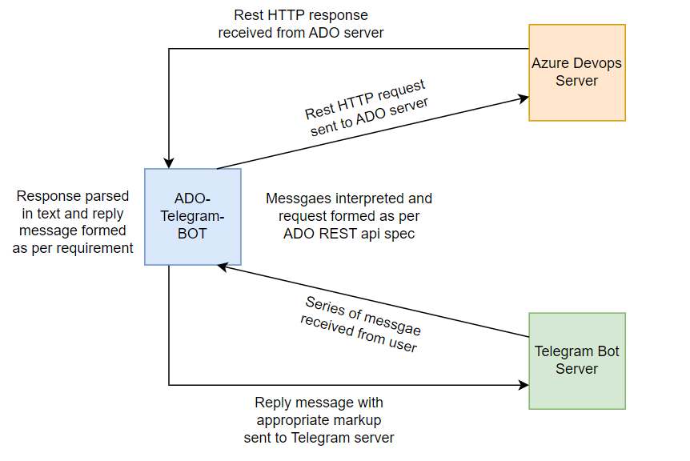

# Azuredevops-telegram-bot
Integration of Azure devops REST api with telegram bot

## Architecture

## Build and run locally

Fork and clone the repository.

copy `config.sample.properties` to `config.properties`.

Fill all the properties in `config.properties` as per your bot and azure-devops project.

Run maven command from root of POM.

    mvn exec:java -Dexec.mainClass="bot.Main"

## Contributing

Create fork and make changes to the new branch. Once tested raise pull request on main repo.